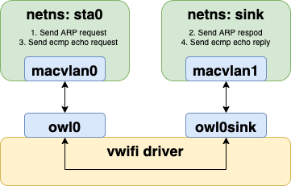

# vwifi: A Simple Virtual Wireless Driver for Linux

`vwifi` implements a minimal interface to achieve basic functionalities,
such as scanning dummy Wi-Fi network, connecting, and disconnecting from it.
`vwifi` is based on [cfg80211 subsystem](https://www.kernel.org/doc/html/latest/driver-api/80211/cfg80211.html),
which works together with FullMAC drivers. At present, it only supports station mode (STA).

## Prerequisite

The following packages must be installed before building `vwifi`.

In order to compile the kernel driver successfully, package versions
of currently used kernel, kernel-devel and kernel-headers need to be matched.
```shell
$ sudo apt install linux-headers-$(uname -r)
```

Since `vwifi` relies on the Linux wireless (IEEE-802.11) subsystem, [iw](https://wireless.wiki.kernel.org/en/users/documentation/iw) is necessary for retrieving more information and configuring:
```shell
sudo apt install iw
```

If you're going to run the test script(scripts/verify.sh), python3, hostapd and some packages
are necessary:
```shell
sudo apt install python3 python3-pip hostapd
pip3 install numpy matplotlib
```

## Build and Run

Run `make` to build the kernel module:
```shell
make
```

Load  `cfg80211` kernel module:
```shell
sudo modprobe cfg80211
```

Insert `vwifi` driver. In this case, vwifi will create two interfaces for us:
```shell
sudo insmod vwifi.ko ssid_list='[MyHomeWiFi][MyWifi_1][MyWifi_2]' interfaces=2
```

Check wiphy:
```shell
iw list
```

Check network interfaces:
```shell
ip link
```

There should be an entry starting with `owl0` and `owl1`, which are exactly the interfaces created by `vwifi`.

Bring up the two network interfaces:
```shell
sudo ip link set owl0 up
sudo ip link set owl1 up
```

Show available wireless interfaces:
```shell
sudo iw dev
```

You should get something as following (the number behind # may be different):
```
phy#8
	Interface owl1
		ifindex 12
		wdev 0x800000001
		addr 00:6f:77:6c:31:00
		type managed
phy#7
	Interface owl0
		ifindex 11
		wdev 0x700000001
		addr 00:6f:77:6c:30:00
		type managed
```

Dump wireless information:
```shell
sudo iw list
```

Reference output:
```
Wiphy phy8
	max # scan SSIDs: 69
	max scan IEs length: 0 bytes
	max # sched scan SSIDs: 0
	max # match sets: 0
	Retry short limit: 7
	Retry long limit: 4
	Coverage class: 0 (up to 0m)
	Available Antennas: TX 0 RX 0
	Supported interface modes:
		 * managed
	Band 1:
		Bitrates (non-HT):
			* 1.0 Mbps
			* 2.0 Mbps
			* 5.5 Mbps
			* 11.0 Mbps
		Frequencies:
			* 2437 MHz [6] (20.0 dBm)
	Supported commands:
		 * set_wiphy_netns
		 * connect
		 * disconnect
	software interface modes (can always be added):
	interface combinations are not supported
	Device supports scan flush.
	max # scan plans: 1
	max scan plan interval: -1
	max scan plan iterations: 0
	Supported extended features:
Wiphy phy7
	... (omit)
```

Get station informations of `owl0`:
```shell
sudo iw dev owl0 station get 00:6f:77:6c:30:00
```

You should get something as following:
```
Station 00:6f:77:6c:30:00 (on owl0)
	inactive time:	7142872 ms
	rx bytes:	0
	rx packets:	0
	tx bytes:	0
	tx packets:	0
	tx failed:	0
	signal:  	-57 dBm
	current time:	1654580295950 ms
```
You can get informations of `owl01` by replacing `00:6f:77:6c:30:00` to
`00:6f:77:6c:31:00`.

Then, perform scanning:
```shell
sudo iw dev owl0 scan
```

You should get the following:
```
BSS 26:05:d1:60:34:c8(on owl0)
	TSF: 7493882579 usec (0d, 02:04:53)
	freq: 2437
	beacon interval: 100 TUs
	capability: ESS (0x0001)
	signal: -31.00 dBm
	last seen: 0 ms ago
	SSID: MyHomeWiFi
```

Finally, we can connect to the dummy SSID `MyHomeWiFi`:
```shell
sudo iw dev owl0 connect MyHomeWiFi
```

Validate the connection:
```shell
sudo iw dev owl0 link
```

Reference output:
```
Connected to 26:05:d1:60:34:c8 (on owl0)
	SSID: MyHomeWiFi
	freq: 2437
```

Change wifi list:
```
echo -n "[MyHomeWiFi][MyWifi_1][MyWifi_2]" | sudo tee /sys/module/vwifi/parameters/ssid_list
```

SSID Naming Convention:

Don't put `[` or `]` in your SSID.
Also, the length of each SSID should be restricted between 0 and 32.
The default value of `ssid_list` is `[MyHomeWiFi]` if it's not specified explicitly by user.

Optional, you can use wireless device monitoring applications such as [wavemon](https://github.com/uoaerg/wavemon) to
watch signal and noise levels, packet statistics, device configuration and network parameters of `vwifi`.
```shell
sudo apt install wavemon
```

<p align="center"></p>


Redirect Packet to Kernel Network Stack:

On the host ingress side, if the incoming packet source IP or source MAC is same as the host, the the packet will be ignored by kernel.
In order to handle the protocol packets via kernel, we create two network namespaces (`netns`) to isolate the host network environment and `viwifi` network counterpart.
A network namespace is a logical copy of the network stack from the host system.
Network namespaces are useful for setting up containers or virtual environments.
Each namespace has its IP addresses, network interfaces, routing tables, and so forth.

On the other hand, a `netns` need an interface to communicate with host network with L2 ability, and [MACVLAN Bridge](https://developers.redhat.com/blog/2018/10/22/introduction-to-linux-interfaces-for-virtual-networking) mode matches the requirement.
The `MACVLAN` provides two essential functionalities for testing scenario.
1. Create L2 virtual network interface for `netns`.
2. Binding L2 virtual network with vwifi network interface.

Hence, when `owl0` received the packet, it will send to the namespace and allow kernel network stack manipulating the protocol packets.

<p align="center"></p>

## License

`vwifi` is released under the MIT license. Use of this source code is governed
by a MIT-style license that can be found in the LICENSE file.

## Reference

* [mac80211_hwsim](https://www.kernel.org/doc/html/latest/networking/mac80211_hwsim/mac80211_hwsim.html): software simulator of 802.11 radio(s) for mac80211
* [Emulating WLAN in Linux - part I: the 802.11 stack](https://linuxembedded.fr/2020/05/emulating-wlan-in-linux-part-i-the-80211-stack)
* [Emulating WLAN in Linux - part II: mac80211_hwsim](https://linuxembedded.fr/2021/01/emulating-wlan-in-linux-part-ii-mac80211hwsim)
* [virt_wifi](https://github.com/torvalds/linux/blob/master/drivers/net/wireless/virt_wifi.c): a completet virtual wireless driver that can be used as a wrapper around Ethernet.
* [vwifi](https://github.com/Raizo62/vwifi): simulate Wi-Fi (802.11) between Linux Virtual Machines.
