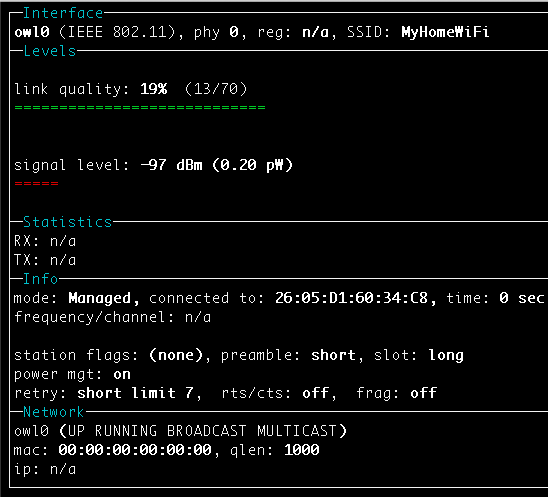

# vwifi: A Simple Virtual Wireless Driver for Linux

`vwifi` implements a minimal interface to achieve basic functonalities,
such as scanning dummy Wi-Fi network, connecting, and disconnecting from it.
`vwifi` is based on [cfg80211 subsystem](https://www.kernel.org/doc/html/latest/driver-api/80211/cfg80211.html),
which works together with FullMAC drivers. At present, it only supports station mode (STA).

## Build

Run `make` to build the kernel module:
```shell
make
```

## Usage

Get necessary packages in advance:
```shell
sudo apt install iw
sudo apt install wireless-tools
```

Add `cfg80211` kernel module:
```shell
sudo modprobe cfg80211
```

Insert `vwifi` driver:
```shell
sudo insmod vwifi.ko ssid_list='[MyHomeWiFi][MyWifi_1][MyWifi_2]'
```

Check network interfaces:
```shell
ip link
```

There should be an entry starting with `owl0`, which is exactly the interface created by `vwifi`.

Bring up the network interface:
```shell
sudo ip link set owl0 up
```

Show available wireless interfaces:
```shell
sudo iw dev
```

You should get something as following:
```
phy#0
	Interface owl0
		ifindex 3
		wdev 0x1
		addr 00:00:00:00:00:00
		type managed
```

Dump wireless information:
```shell
sudo iw list
```

Reference output:
```
Wiphy owl
	max # scan SSIDs: 69
	max scan IEs length: 0 bytes
	max # sched scan SSIDs: 0
	max # match sets: 0
	max # scan plans: 1
	max scan plan interval: -1
	max scan plan iterations: 0
	Retry short limit: 7
	Retry long limit: 4
	Coverage class: 0 (up to 0m)
	Available Antennas: TX 0 RX 0
	Supported interface modes:
		 * managed
```

Then, perform scanning:
```shell
sudo iw dev owl0 scan
```

You should get the following:
```
BSS ca:9c:00:c6:c2:eb(on owl0)
	TSF: 0 usec (0d, 00:00:00)
	freq: 2437
	beacon interval: 100 TUs
	capability: ESS (0x0001)
	signal: -59.00 dBm
	last seen: 0 ms ago
	SSID: MyHomeWifi
	SSID: MyHomeWiFi
```

Finally, we can connect to the dummy SSID `MyHomeWiFi`:
```shell
sudo iw dev owl0 connect MyHomeWiFi
```

Validate the connection:
```shell
sudo iw dev owl0 link
```

Reference output:
```
Connected to 26:05:d1:60:34:c8 (on owl0)
	SSID: MyHomeWiFi
	freq: 2437
command failed: Operation not supported (-95)
```

Change wifi list:
```
echo -n "[MyHomeWiFi][MyWifi_1][MyWifi_2]" | sudo tee /sys/module/vwifi/parameters/ssid_list
```

SSID Naming Convention:

Don't put `[` or `]` in your SSID.
Also, the length of each SSID should be restricted between 0 and 32.
The default value of `ssid_list` is `[MyHomeWiFi]` if it's not specified explicitly by user.

Optional, you can use wireless device monitoring applications such as [wavemon](https://github.com/uoaerg/wavemon) to
watch signal and noise levels, packet statistics, device configuration and network parameters of `vwifi`.
```shell
sudo apt install wavemon
```

<p align="center"></p>


## License

`vwifi` is released under the MIT license. Use of this source code is governed
by a MIT-style license that can be found in the LICENSE file.

## Reference

* [mac80211_hwsim](https://www.kernel.org/doc/html/latest/networking/mac80211_hwsim/mac80211_hwsim.html): software simulator of 802.11 radio(s) for mac80211
* [Emulating WLAN in Linux - part I: the 802.11 stack](https://linuxembedded.fr/2020/05/emulating-wlan-in-linux-part-i-the-80211-stack)
* [Emulating WLAN in Linux - part II: mac80211_hwsim](https://linuxembedded.fr/2021/01/emulating-wlan-in-linux-part-ii-mac80211hwsim)
* [virt_wifi](https://github.com/torvalds/linux/blob/master/drivers/net/wireless/virt_wifi.c): a completet virtual wireless driver that can be used as a wrapper around Ethernet.
* [vwifi](https://github.com/Raizo62/vwifi): simulate Wi-Fi (802.11) between Linux Virtual Machines.
