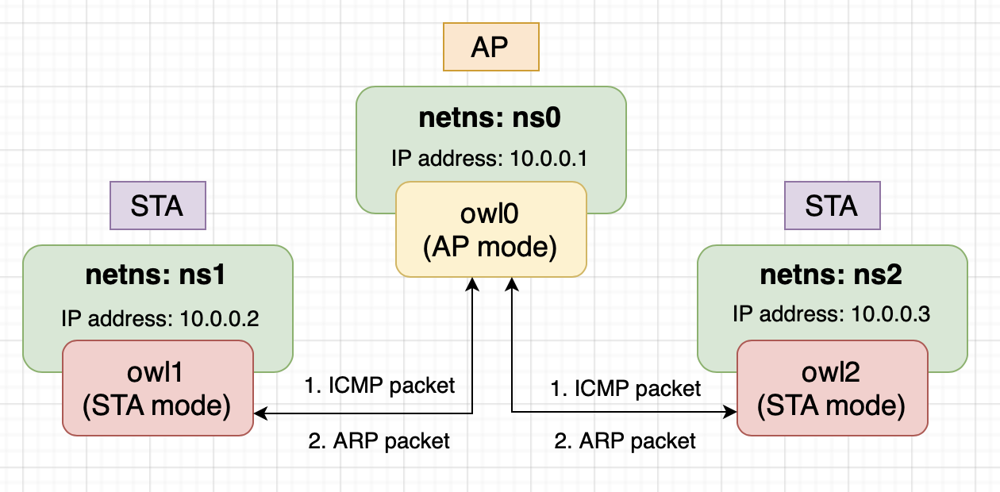

# vwifi: A Simple Virtual Wireless Driver for Linux

`vwifi` implements a minimal interface to achieve basic functionalities,
such as scanning dummy Wi-Fi network, connecting, and disconnecting from it.
`vwifi` is based on [cfg80211 subsystem](https://www.kernel.org/doc/html/latest/driver-api/80211/cfg80211.html),
which works together with FullMAC drivers. At present, it supports station mode and Host AP mode.

## Prerequisite

The following packages must be installed before building `vwifi`.

In order to compile the kernel driver successfully, package versions
of currently used kernel, kernel-devel and kernel-headers need to be matched.
```shell
$ sudo apt install linux-headers-$(uname -r)
```

Since `vwifi` relies on the Linux wireless (IEEE-802.11) subsystem, [iw](https://wireless.wiki.kernel.org/en/users/documentation/iw) is necessary for retrieving more information and configuring:
```shell
sudo apt install iw
```

If you're going to run the test script(`scripts/verify.sh`), python3, hostapd and some packages
are necessary:
```shell
sudo apt install python3 python3-pip hostapd
pip3 install numpy matplotlib
```

## Testing environment

<p align="center"></p>

In our testing environment, we have **one AP and two STA**.

The testing environment is running in IEEE 802.11 infrastructure BSS, so it comes to a constraint: **STA cannot talk to other STAs directly**. Once a STA want to communicate to others, it must pass the packets to AP, and then AP will do the following stuff based on the packet type:
	1. unicast: if the packet is for another STA, then pass it
                to the STA and do not pass to protocol stack,
                otherwise (packet is for AP itself) pass it to
                protocol stack.
	2. broadcast: pass packet to another STA except the source STA,
   	              then pass it to protocol stack.
 	3. multicast: do the same thing as broadcast.

In order to test the network enviroment, we can make use of the **Linux network namespace**. Linux network namespace can isolate a network environment from the host, i.e., with its own routes, firewall rules, and network devices. In fact, it's logically another copy of the network stack.

Without network namespace, once we create virtual interfaces (shares the same network namesapce) and we start to transmit/receive packets between them, kernel will use loopback device for packet transmission/reception because kernel found that the sender and receiver is on the same host.

In conclusion, all the interfaces created by `vwifi` in our testing environment will be added to a isolated network naemspace.

## Build and Run

Run `make` to build the kernel module:
```shell
make
```

Load  `cfg80211` kernel module:
```shell
sudo modprobe cfg80211
```

Insert `vwifi` driver. In this case, vwifi will create three interfaces for us:
(you can change the parameter "station" on your favor)
```shell
sudo insmod vwifi.ko station=3
```

We can only create interfaces in station mode in the initilization phase,
but don't worry, they can be turned to Host AP mode by hostapd afterward.

Check network interfaces:
```shell
ip link
```

There should be an entry starting with `owl0`, `owl1` and `owl2`, which are exactly the interfaces created by `vwifi`.

Show available wireless interfaces:
```shell
sudo iw dev
```

You should get something like the following:
```
phy#13
	Interface owl2
		ifindex 16
		wdev 0xd00000001
		addr 00:6f:77:6c:32:00
		type managed
phy#12
	Interface owl1
		ifindex 15
		wdev 0xc00000001
		addr 00:6f:77:6c:31:00
		type managed
phy#11
	Interface owl0
		ifindex 14
		wdev 0xb00000001
		addr 00:6f:77:6c:30:00
		type managed
```

As you can see, all interfaces own its phy (`struct wiphy`), which means 
they can be put into the separate network namespaces.

Dump wireless information:
```shell
sudo iw list
```

Reference output:
```
Wiphy phy13
	max # scan SSIDs: 69
	max scan IEs length: 0 bytes
	max # sched scan SSIDs: 0
	max # match sets: 0
	Retry short limit: 7
	Retry long limit: 4
	Coverage class: 0 (up to 0m)
	Available Antennas: TX 0 RX 0
	Supported interface modes:
		 * managed
		 * AP
	Band 1:
		Bitrates (non-HT):
			* 1.0 Mbps
			* 2.0 Mbps
			* 5.5 Mbps
			* 11.0 Mbps
		Frequencies:
			* 2437 MHz [6] (20.0 dBm)
	Supported commands:
		 * set_interface
		 * start_ap
		 * set_wiphy_netns
		 * set_channel
		 * connect
		 * disconnect
	software interface modes (can always be added):
	interface combinations are not supported
	Device supports scan flush.
	max # scan plans: 1
	max scan plan interval: -1
	max scan plan iterations: 0
	Supported extended features:
Wiphy phy14
	... (omit)
Wiphy phy15
	... (omit)
```

The "managed mode" in Supported interface modes is identical
to station mode.

Get station informations of `owl0`:
```shell
sudo iw dev owl0 station get 00:6f:77:6c:30:00
```

You should get something as following:
```
Station 00:6f:77:6c:30:00 (on owl0)
	inactive time:	600260 ms
	rx bytes:	0
	rx packets:	0
	tx bytes:	0
	tx packets:	0
	tx failed:	0
	signal:  	-33 dBm
	current time:	1655310275763 ms
```

Then, create three network namespaces:
```shell
sudo ip netns add ns0
sudo ip netns add ns1
sudo ip netns add ns2
````

Put the three interfaces into separate network namespaces:
(actually, we put the `wiphy` into network namespace, and the 
interface on top of the `wiphy` will be in there.)
```shell
sudo iw phy phy11 set netns name ns0
sudo iw phy phy12 set netns name ns1
sudo iw phy phy13 set netns name ns2
```

Then, bring up the three interfaces:
```shell
sudo ip netns exec ns0 ip link set owl0 up
sudo ip netns exec ns1 ip link set owl1 up
sudo ip netns exec ns2 ip link set owl2 up
```

Running `hostapd` based on the script `scripts/hostapd.conf`:
```shell
interface=owl0
driver=nl80211
ssid=TestAP
channel=6
```

Make sure running `hostapd` in the network namespace that `owl0` is in:
```shell	
sudo ip netns exec ns0 hostapd -B scripts/hostapd.conf
```

Now, that's assign IP address for each interface:
```shell
sudo ip netns exec ns0 ip addr add 10.0.0.1/24 dev owl0
sudo ip netns exec ns1 ip addr add 10.0.0.2/24 dev owl1
sudo ip netns exec ns2 ip addr add 10.0.0.3/24 dev owl2
```

Then ping `owl2` (10.0.0.3) by `owl1` (10.0.0.2):
```shell
sudo ip netns exec ns1 ping -c 1 10.0.0.3
```

You should fail to ping `owl2` by `owl1`, it's normal.
Because they haven't connected to AP `owl0` (`SSID: TestAP`),
and STA are not allowed to communicate with others without
the intervention of AP.

Then, perform scanning on `owl1`:
```shell
sudo ip netns exec ns1 iw dev owl1 scan
```

You should get the following:
```shell
BSS 00:6f:77:6c:30:00(on owl1)
	TSF: 1859697982 usec (0d, 00:30:59)
	freq: 2437
	beacon interval: 100 TUs
	capability: ESS (0x0001)
	signal: -43.00 dBm
	last seen: 0 ms ago
	SSID: TestAP
```

Do the same thing to `owl2`.

Then connect `owl1` and `owl2` to AP `owl0` (`SSID: TestAP`):
```shell
sudo ip netns exec ns1 iw dev owl1 connect TestAP
sudo ip netns exec ns2 iw dev owl2 connect TestAP
```

Validate the connection:
```shell
sudo ip netns exec ns1 iw dev owl1 link
```

Reference output:
```shell
Connected to 00:6f:77:6c:30:00 (on owl1)
	SSID: TestAP
	freq: 2437
	RX: 0 bytes (0 packets)
	TX: 0 bytes (0 packets)
	signal: -31 dBm
```

Finally, we can do the ping test:
1. ping between two STA (`owl1`, `owl2`)
```shell
sudo ip netns exec ns1 ping -c 4 10.0.0.3
```

You should get something like the following:
```shell
PING 10.0.0.3 (10.0.0.3) 56(84) bytes of data.
64 bytes from 10.0.0.3: icmp_seq=1 ttl=64 time=0.188 ms
64 bytes from 10.0.0.3: icmp_seq=2 ttl=64 time=0.147 ms
64 bytes from 10.0.0.3: icmp_seq=3 ttl=64 time=0.082 ms
64 bytes from 10.0.0.3: icmp_seq=4 ttl=64 time=0.136 ms

--- 10.0.0.3 ping statistics ---
4 packets transmitted, 4 received, 0% packet loss, time 3036ms
rtt min/avg/max/mdev = 0.082/0.138/0.188/0.037 ms
```

2. ping between AP (`owl0`) and STA (`owl2`)
```shell
sudo ip netns exec ns2 ping -c 4 10.0.0.1
```

You should get something like the following.

```shell
PING 10.0.0.1 (10.0.0.1) 56(84) bytes of data.
64 bytes from 10.0.0.1: icmp_seq=1 ttl=64 time=0.342 ms
64 bytes from 10.0.0.1: icmp_seq=2 ttl=64 time=0.054 ms
64 bytes from 10.0.0.1: icmp_seq=3 ttl=64 time=0.106 ms
64 bytes from 10.0.0.1: icmp_seq=4 ttl=64 time=0.063 ms

--- 10.0.0.1 ping statistics ---
4 packets transmitted, 4 received, 0% packet loss, time 3058ms
rtt min/avg/max/mdev = 0.054/0.141/0.342/0.117 ms
```

We can simply run the test script `scripts/verify.sh` for doing all the operations above.

Optional, you can use wireless device monitoring applications such as [wavemon](https://github.com/uoaerg/wavemon) to
watch signal and noise levels, packet statistics, device configuration and network parameters of `vwifi`.
```shell
sudo apt install wavemon
```

<p align="center"></p>

## License

`vwifi` is released under the MIT license. Use of this source code is governed
by a MIT-style license that can be found in the LICENSE file.

## Reference

* [mac80211_hwsim](https://www.kernel.org/doc/html/latest/networking/mac80211_hwsim/mac80211_hwsim.html): software simulator of 802.11 radio(s) for mac80211
* [Emulating WLAN in Linux - part I: the 802.11 stack](https://linuxembedded.fr/2020/05/emulating-wlan-in-linux-part-i-the-80211-stack)
* [Emulating WLAN in Linux - part II: mac80211_hwsim](https://linuxembedded.fr/2021/01/emulating-wlan-in-linux-part-ii-mac80211hwsim)
* [virt_wifi](https://github.com/torvalds/linux/blob/master/drivers/net/wireless/virt_wifi.c): a completet virtual wireless driver that can be used as a wrapper around Ethernet.
* [vwifi](https://github.com/Raizo62/vwifi): simulate Wi-Fi (802.11) between Linux Virtual Machines.
