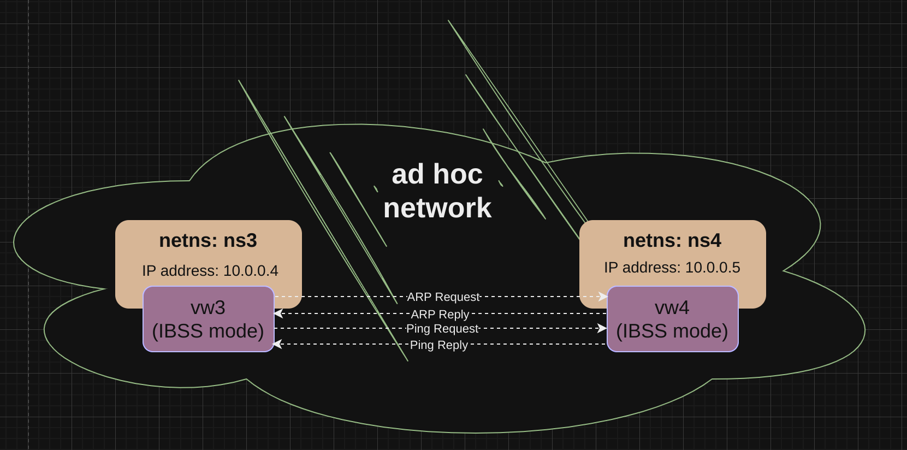
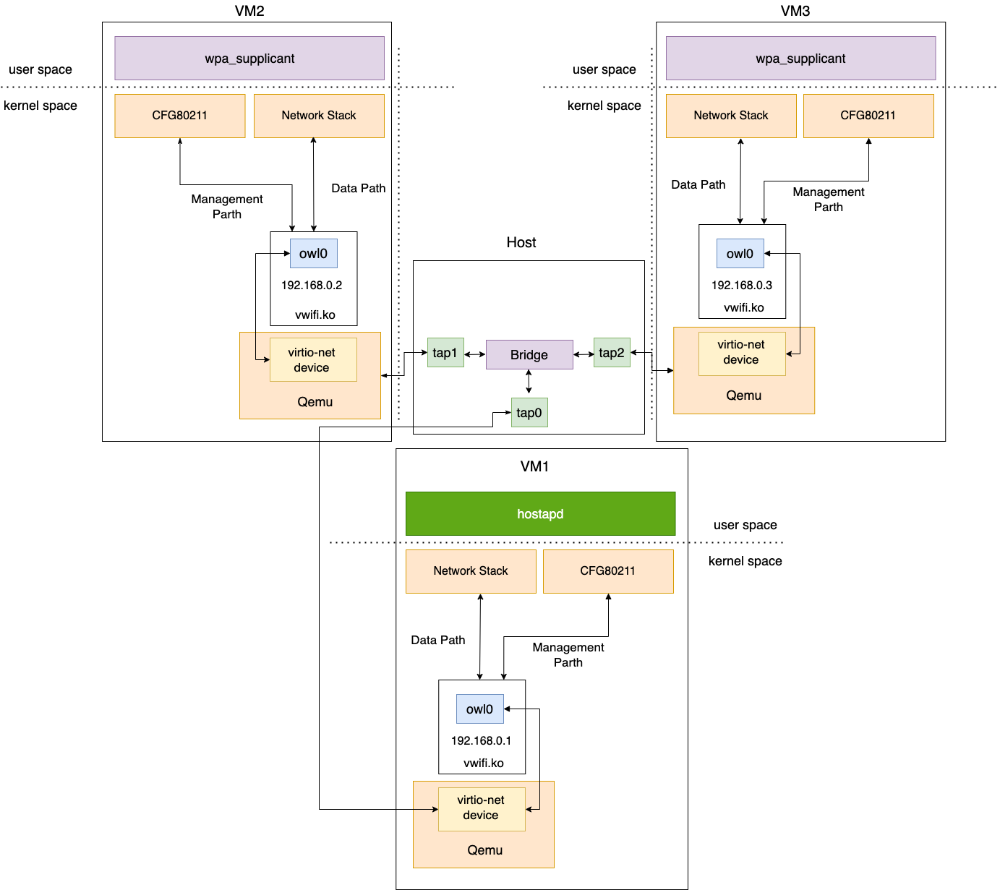

# vwifi: A Simple Virtual Wireless Driver for Linux

`vwifi` implements a minimal interface to provide essential functionalities,
such as scanning for dummy Wi-Fi networks, establishing connections, and
disconnecting from them.

It is built upon the [cfg80211 subsystem](https://www.kernel.org/doc/html/latest/driver-api/80211/cfg80211.html),
which collaborates with FullMAC drivers. Currently, `vwifi` supports both
Station Mode and Host AP Mode and is equipped with robust WPA/WPA2 security
features. This enables users to configure a wireless environment using `vwifi`,
`hostapd` (in HostAP mode interface), and `wpa_supplicant` (in station mode interface).

Moreover, when running on hypervisors like QEMU, `vwifi` functions as a virtio-net
driver, allowing for inter-guest communication.

## Prerequisite

The following packages must be installed before building `vwifi`.

To compile the kernel driver successfully, the package versions of the currently used kernel,
kernel-devel, and kernel-headers need to be matched. Run the following command to install the required kernel headers:
```shell
$ sudo apt install linux-headers-$(uname -r)
```

Since `vwifi` relies on the Linux wireless (IEEE-802.11) subsystem, [iw](https://wireless.wiki.kernel.org/en/users/documentation/iw) is necessary for retrieving more information and configuring.
Install it using the following command:
```shell
$ sudo apt install iw
```

If running the test script (scripts/verify.sh), Python 3, hostapd, and some additional packages are necessary.
```shell
$ sudo apt install python3 python3-pip hostapd
$ pip3 install numpy matplotlib
```

## Testing environment (non-virtio)
To test the network environment effectively, we utilize **Linux network namespaces**. These namespaces isolate network environments from the host system, providing distinct instances of network stacks with independent routes, firewall rules, and network devices.

Without network namespaces, virtual interfaces created within the same namespace use the loopback device for packet transmission between them, as the kernel recognizes them as residing on the same host.

In our testing setup, all interfaces created by `vwifi` are placed within an isolated network namespace. This approach ensures that each virtual interface operates independently, facilitating comprehensive testing of networking functionalities without interference from the host's network configuration.

Below, we will conduct two separate tests: Infrastructure BSS and Independent BSS.
### Infrastructure BSS
<p align="center"></p>

The testing environment consists of **one AP and two STAs**.

The testing environment operates in IEEE 802.11 infrastructure BSS, which imposes a constraint: **STAs cannot directly communicate with each other**.
When an STA wants to communicate with other devices, it must send packets to the AP.
The AP then performs the following actions based on the packet type:
1. Unicast: If the packet is intended for another STA, the AP forwards it directly to the destination STA without passing it to the protocol stack.
   If the packet is intended for the AP itself, it is passed to the protocol stack.
2. Broadcast: The AP forwards the packet to all other STAs in the network, except for the source STA, and then passes it to the protocol stack.
3. Multicast: The AP treats multicast packets the same way as broadcast packets.

### Independent BSS
<p align="center"></p>

The testing environment consists of **two IBSS devices**.

The testing environment operates in IEEE 802.11 independent BSS. IBSS devices can communicate with any device in the same IBSS network **without the need to establish a connection beforehand**. However, devices in different IBSS networks cannot communicate with each other.
## Build and Run (non-virtio)

To build the kernel module, execute the following command:
```shell
$ make
```

Load the cfg80211 kernel module by running the following command:
```shell
$ sudo modprobe cfg80211
```

Insert the `vwifi` driver.
This will create three interfaces (the "station" parameter can be modified according to preference):
```shell
$ sudo insmod vwifi.ko station=5
```

Please note that interfaces can only be created in station mode during the initialization phase.
However, they can be switched to Host AP mode later using hostapd.

### Checking Network Interfaces

To check the network interfaces, run the following command:
```shell
$ ip link
```

There should be entries starting with `vw0`, `vw1`, `vw2`, `vw3`, and `vw4`, which correspond to the interfaces created by `vwifi`.

To view the available wireless interfaces, execute the following command:
```shell
$ sudo iw dev
```

You should see something similar to the following output:
```
phy#5
	Interface vw4
		ifindex 7
		wdev 0x500000001
		addr 00:76:77:34:00:00
		type managed
		txpower 0.00 dBm
phy#4
	Interface vw3
		ifindex 6
		wdev 0x400000001
		addr 00:76:77:33:00:00
		type managed
		txpower 0.00 dBm
phy#3
	Interface vw2
		ifindex 5
		wdev 0x300000001
		addr 00:76:77:32:00:00
		type managed
		txpower 0.00 dBm
phy#2
	Interface vw1
		ifindex 4
		wdev 0x200000001
		addr 00:76:77:31:00:00
		type managed
		txpower 0.00 dBm
phy#1
	Interface vw0
		ifindex 3
		wdev 0x100000001
		addr 00:76:77:30:00:00
		type managed
		txpower 0.00 dBm
```

As observed, each interface has its own phy (`struct wiphy`), allowing them to be placed into separate network namespaces.

### Dumping Wireless Information

To obtain wireless information, execute the following command:
```shell
$ sudo iw list
```

Reference output:
```
Wiphy vw_phy4
(... omit)
Wiphy vw_phy3
(... omit)
Wiphy vw_phy2
(... omit)
Wiphy vw_phy1
(... omit)
Wiphy vw_phy0
	wiphy index: 0
	max # scan SSIDs: 69
	max scan IEs length: 0 bytes
	max # sched scan SSIDs: 0
	max # match sets: 0
	Retry short limit: 7
	Retry long limit: 4
	Coverage class: 0 (up to 0m)
	Supported Ciphers:
		* WEP40 (00-0f-ac:1)
		* WEP104 (00-0f-ac:5)
		* TKIP (00-0f-ac:2)
		* CCMP-128 (00-0f-ac:4)
	Available Antennas: TX 0 RX 0
	Supported interface modes:
		 * managed
		 * AP
	Band 1:
		Bitrates (non-HT):
			* 1.0 Mbps
			* 2.0 Mbps
			* 5.5 Mbps
			* 11.0 Mbps
			* 6.0 Mbps
			* 9.0 Mbps
			* 12.0 Mbps
			* 18.0 Mbps
			* 24.0 Mbps
			* 36.0 Mbps
			* 48.0 Mbps
			* 54.0 Mbps
		Frequencies:
			* 2412 MHz [1] (20.0 dBm)
			* 2417 MHz [2] (20.0 dBm)
			* 2422 MHz [3] (20.0 dBm)
			* 2427 MHz [4] (20.0 dBm)
			* 2432 MHz [5] (20.0 dBm)
			* 2437 MHz [6] (20.0 dBm)
			* 2442 MHz [7] (20.0 dBm)
			* 2447 MHz [8] (20.0 dBm)
			* 2452 MHz [9] (20.0 dBm)
			* 2457 MHz [10] (20.0 dBm)
			* 2462 MHz [11] (20.0 dBm)
			* 2467 MHz [12] (20.0 dBm) (no IR)
			* 2472 MHz [13] (20.0 dBm) (no IR)
			* 2484 MHz [14] (20.0 dBm) (no IR)
	Supported commands:
		 * set_interface
		 * new_key
		 * start_ap
		 * set_wiphy_netns
		 * set_channel
		 * connect
		 * disconnect
	software interface modes (can always be added):
	interface combinations are not supported
	Device supports scan flush.
	max # scan plans: 1
	max scan plan interval: -1
	max scan plan iterations: 0
	Supported extended features:
```

You can see the supported operating modes, supported ciphers, channels, bitrates, and supported commands in the output.

The "managed mode" in the Supported interface modes is identical to station mode.

### Creating Network Namespaces
Next, create three network namespaces using the following commands:
```shell
$ sudo ip netns add ns0
$ sudo ip netns add ns1
$ sudo ip netns add ns2
````

Find the `wiphy` name for the three interfaces.
The index number for the `wiphy` name postfix might be different each time.
Please use the following command for the ease of memorizing different index number everytime.
```shell
$ vw0_phy=$(sudo iw dev vw0 info | grep wiphy | awk '{print $2}')
$ vw0_phy=$(sudo iw list | grep "wiphy index: $vw0_phy" -B 1 | grep Wiphy | awk '{print $2}')
$ vw1_phy=$(sudo iw dev vw1 info | grep wiphy | awk '{print $2}')
$ vw1_phy=$(sudo iw list | grep "wiphy index: $vw1_phy" -B 1 | grep Wiphy | awk '{print $2}')
$ vw2_phy=$(sudo iw dev vw2 info | grep wiphy | awk '{print $2}')
$ vw2_phy=$(sudo iw list | grep "wiphy index: $vw2_phy" -B 1 | grep Wiphy | awk '{print $2}')
```

Check whether the name of each `wiphy` is the same as the name listing under the command `sudo iw list`
```shell
$ echo $vw0_phy
vw_phy0
$ echo $vw1_phy
vw_phy1
$ echo $vw2_phy
vw_phy2
```

Assign the three interfaces to separate network namespaces.
Please note that the `wiphy` is placed within the network namespace, and the interface associated with that wiphy will be contained within it.
```shell
$ sudo iw phy vw_phy0 set netns name ns0
$ sudo iw phy vw_phy1 set netns name ns1
$ sudo iw phy vw_phy2 set netns name ns2
```

### Assigning IP Addresses to Each Interface

Now, assign an IP address to both interfaces using the following commands:
```shell
$ sudo ip netns exec ns0 ip addr add 10.0.0.1/24 dev vw0
$ sudo ip netns exec ns1 ip addr add 10.0.0.2/24 dev vw1
$ sudo ip netns exec ns2 ip addr add 10.0.0.3/24 dev vw2
```

### Running hostapd on the HostAP Mode Interface
Prepare the following script `hostapd.conf` (you can modify the script based on your needs):
```
interface=vw0
driver=nl80211
debug=1
ctrl_interface=/var/run/hostapd
ctrl_interface_group=wheel
channel=6
ssid=test
wpa=2
wpa_passphrase=12345678
wpa_key_mgmt=WPA-PSK
wpa_pairwise=CCMP
```

Run `hostapd` on the interface `vw0`:
```shell	
$ sudo ip netns exec ns0 hostapd -i vw0 -B scripts/hostapd.conf
```

### Running `wpa_supplicant` on the Station Mode Interfaces
Prepare the following script `wpa_supplicant.conf` (you can modify the script based on your needs):
```shell
network={
    ssid="test"
    psk="12345678"
}
```

Then run the `wpa_supplicant` on the interface `ns1` and `ns2`:
```shell
$ sudo ip netns exec ns1 \
       wpa_supplicant -i vw1 -B -c scripts/wpa_supplicant.conf
$ sudo ip netns exec ns2 \
      wpa_supplicant -i vw2 -B -c scripts/wpa_supplicant.conf 
```

### Validating the Connection
To validate the connection, use the following command:
```shell
$ sudo ip netns exec ns1 iw dev vw1 link
```

The output might seem like this:
```
Connected to 00:6f:77:6c:30:00 (on vw1)
	SSID: test
	freq: 2437
	RX: 282 bytes (2 packets)
	TX: 248 bytes (2 packets)
	signal: -84 dBm
```

It shows that `vw1` has connected to the BSS with BSSID `00:6f:77:6c:30:00`, which is the MAC address of `vw0`.

You may also check the connection of `vw2` by slightly changing the command above.

On the other hand, we can validate all the stations connected to `vw0` by the following commands:
```shell
sudo ip netns exec ns0 iw dev vw0 station dump
```

The output may seem like this:
```
Station 00:6f:77:6c:31:00 (on vw0)
	inactive time:	5588 ms
	rx bytes:	5366
	rx packets:	65
	tx bytes:	1772
	tx packets:	18
	tx failed:	74
	signal:  	-57 dBm
	current time:	1689679337171 ms
Station 00:6f:77:6c:32:00 (on vw0)
	inactive time:	5588 ms
	rx bytes:	5366
	rx packets:	65
	tx bytes:	1772
	tx packets:	18
	tx failed:	74
	signal:  	-57 dBm
	current time:	1689679337171 ms
```

### Transmission/Receivement test
Finally, we can do the ping test:
1. To perform a ping test between two STAs (`vw1` and `vw2`), use the following command:
```shell
$ sudo ip netns exec ns1 ping -c 4 10.0.0.3
```

You should see output similar to the following:
```
PING 10.0.0.3 (10.0.0.3) 56(84) bytes of data.
64 bytes from 10.0.0.3: icmp_seq=1 ttl=64 time=0.188 ms
64 bytes from 10.0.0.3: icmp_seq=2 ttl=64 time=0.147 ms
64 bytes from 10.0.0.3: icmp_seq=3 ttl=64 time=0.082 ms
64 bytes from 10.0.0.3: icmp_seq=4 ttl=64 time=0.136 ms

--- 10.0.0.3 ping statistics ---
4 packets transmitted, 4 received, 0% packet loss, time 3036ms
rtt min/avg/max/mdev = 0.082/0.138/0.188/0.037 ms
```

2. To perform a ping test between the AP (`vw0`) and a STA (`vw2`), execute the following command:
```shell
$ sudo ip netns exec ns2 ping -c 4 10.0.0.1
```

You should see output similar to the following:
```
PING 10.0.0.1 (10.0.0.1) 56(84) bytes of data.
64 bytes from 10.0.0.1: icmp_seq=1 ttl=64 time=0.342 ms
64 bytes from 10.0.0.1: icmp_seq=2 ttl=64 time=0.054 ms
64 bytes from 10.0.0.1: icmp_seq=3 ttl=64 time=0.106 ms
64 bytes from 10.0.0.1: icmp_seq=4 ttl=64 time=0.063 ms

--- 10.0.0.1 ping statistics ---
4 packets transmitted, 4 received, 0% packet loss, time 3058ms
rtt min/avg/max/mdev = 0.054/0.141/0.342/0.117 ms
```
### IBSS mode

#### Creating Network Namespaces
Create three network namespaces using the following commands:
```shell
$ sudo ip netns add ns3
$ sudo ip netns add ns4
```
Find the `wiphy` name for the two interfaces.
The index number for the `wiphy` name postfix might be different each time.
Please use the following command for the ease of memorizing different index number everytime.
```shell
$ vw3_phy=$(sudo iw dev vw3 info | grep wiphy | awk '{print $2}')
$ vw3_phy=$(sudo iw list | grep "wiphy index: $vw3_phy" -B 1 | grep Wiphy | awk '{print $2}')
$ vw4_phy=$(sudo iw dev vw4 info | grep wiphy | awk '{print $2}')
$ vw4_phy=$(sudo iw list | grep "wiphy index: $vw4_phy" -B 1 | grep Wiphy | awk '{print $2}')
```
Check whether the name of each `wiphy` is the same as the name listing under the command `sudo iw list`
```shell
$ echo $vw3_phy
vw_phy3
$ echo $vw4_phy
vw_phy4
```
Assign the two interfaces to separate network namespaces.
Please note that the `wiphy` is placed within the network namespace, and the interface associated with that wiphy will be contained within it.
```shell
$ sudo iw phy vw_phy3 set netns name ns3
$ sudo iw phy vw_phy4 set netns name ns4
```
#### Assigning IP Addresses to Each Interface

Now, assign an IP address to both interfaces using the following commands:
```shell
$ sudo ip netns exec ns3 ip addr add 10.0.0.4/24 dev vw3
$ sudo ip netns exec ns4 ip addr add 10.0.0.5/24 dev vw4
```
There are two methods to configure an IBSS network: manual configuration or using WPA.
#### Option1 : Manual configuration
##### Switch to IBSS mode
Switch device to IBSS mode using the following command : 

***iw dev [interface] set type ibss***

The following commands switch `vw3` and `vw4` to IBSS mode. 
```shell
$ sudo ip netns exec ns3 iw dev vw3 set type ibss
$ sudo ip netns exec ns4 iw dev vw4 set type ibss
```
Check the information of `vw3`.
```shell
$ sudo ip netns exec ns3 iw dev vw3 info
```
You should see output similar to the following:
```
Interface vw3
	ifindex 6
	wdev 0x400000001
	addr 00:76:77:33:00:00
	type IBSS
	wiphy 4
	txpower 0.00 dBm
```
##### Join IBSS network
```shell
$ sudo ip netns exec ns3 ip link set vw3 up
$ sudo ip netns exec ns4 ip link set vw4 up
```
Users can join a specific IBSS cell and configure additional settings using the command :

***iw dev [interface] ibss join [SSID] [freq in MHz] [NOHT|HT20|HT40+|HT40-|5MHz|10MHz|80MHz] [fixed-freq] [fixed-bssid] [beacon-interval <TU>] [basic-rates <rate in Mbps,rate2,…>] [mcast-rate <rate in Mbps>] [key d:0:abcde]*** 

If the IBSS cell does not already exist, it will be created.

The following command makes `vw3` and `vw4` join the same IBSS cell with the SSID `ibss1` and specifies the frequency as 2412 MHz:
```shell
$ sudo ip netns exec ns3 iw dev vw3 ibss join ibss1 2412 NOHT fixed-freq 00:76:77:33:00:00 beacon-interval 200
$ sudo ip netns exec ns4 iw dev vw4 ibss join ibss1 2412 NOHT fixed-freq 00:76:77:33:00:00 beacon-interval 200
```
Check the information of `vw3`.
```shell
$ sudo ip netns exec ns3 iw dev vw3 info
```
You should see output similar to the following:
```
Interface vw3
	ifindex 6
	wdev 0x400000001
	addr 00:76:77:33:00:00
	ssid ibss1
	type IBSS
	wiphy 4
	txpower 0.00 dBm
```
#### Option2 : Using WPA
```shell
$ sudo ip netns exec ns3 ip link set vw3 up
$ sudo ip netns exec ns4 ip link set vw4 up
```
Prepare the following script `wpa_supplicant_ibss.conf` (you can modify the script based on your needs):
```shell
network={
    ssid="ibss1"
    mode=1
    frequency=2412
    key_mgmt=WPA-PSK
    proto=RSN
    pairwise=CCMP
    group=CCMP
    psk="12345678"
}
```
Using the command **wpa_supplicant**, configure `vw3` and `vw4` to join `ibss1`.
```shell
$ sudo ip netns exec ns3 wpa_supplicant -i vw3 -B -c scripts/wpa_supplicant_ibss.conf
$ sudo ip netns exec ns4 wpa_supplicant -i vw4 -B -c scripts/wpa_supplicant_ibss.conf
```
Check the information of `vw3`.
```shell
$ sudo ip netns exec ns3 iw dev vw3 info
```
You should see output similar to the following:
```
Interface vw3
	ifindex 6
	wdev 0x400000001
	addr 00:76:77:33:00:00
	ssid ibss1
	type IBSS
	wiphy 4
	txpower 0.00 dBm
```
#### Transmission/Receivement test
To perform a ping test between two IBSS devices (`vw3` and `vw4`) in the same ibss cell (`ibss1`), use the following command:
```shell
$ sudo ip netns exec ns3 ping -c 1 10.0.0.5
```
You should see output similar to the following:
```
PING 10.0.0.5 (10.0.0.5) 56(84) bytes of data.
64 bytes from 10.0.0.5: icmp_seq=1 ttl=64 time=0.093 ms

--- 10.0.0.5 ping statistics ---
1 packets transmitted, 1 received, 0% packet loss, time 0ms
rtt min/avg/max/mdev = 0.093/0.093/0.093/0.000 ms
```
#### Leave IBSS network
To leave the current IBSS cell, use ***iw dev [interface] ibss leave***. 

The following command makes `vw3` and `vw4` leave `ibss1`:
```shell
$ sudo ip netns exec ns3 iw dev vw3 ibss leave
$ sudo ip netns exec ns4 iw dev vw4 ibss leave
```
Check the information of `vw3`.
```shell
$ sudo ip netns exec ns3 iw dev vw3 info
```
You should see output similar to the following:
```
Interface vw3
	ifindex 6
	wdev 0x400000001
	addr 00:76:77:33:00:00
	type IBSS
	wiphy 4
	txpower 0.00 dBm
```

### vwifi-tool
A userspace tool which supports more user-specific utilization for vwifi.
Aiming to provide more flexibility and customization for users of vwifi.
Currently supporting feature:
* display the status of vwifi driver
* Use netlink socket to communicate with vwifi driver allowing user to configure user-specific deny list

#### Status checking
We can use `vwifi-tool` to check the status of vwifi driver by executing the following command:
```
$ ./vwifi-tool
```
If vwifi is loaded into kernel, you should see the following output:
```
vwifi status : live
```
Otherwise, vwifi isn't loaded into kernel yet, the output will be:
```
vwifi status : not loaded
```

#### Denylist test
vwifi also supports denylist ability to allow some interfaces to deny packets from certain interfaces.
We can use `vwifi-tool` to set or unset denylist for vwifi, multiple options are explained as below
* `-d` : specify the destination interface for a denylist pair
* `-s` : specify the source interface for a denylist pair
* `-c` : `1` means to unset the denylist in vwifi, default as `0`

Set the denylist pair using vwifi-tool like the following
```
$ ./vwifi-tool -d vw2 -s vw1
```
You should see the following output, including your denylist which will be sent to vwifi
```
vwifi status : live
denylist:
vw2 denys vw1
Configuring denylist for vwifi...
Message from vwifi: vwifi has received your denylist
```
Then you can try to do the ping test again
```
$ sudo ip netns exec ns1 ping -c 4 10.0.0.3
```
You should see the following output:
```
PING 10.0.0.3 (10.0.0.3) 56(84) bytes of data.

--- 10.0.0.3 ping statistics ---
4 packets transmitted, 0 received, 100% packet loss, time 3053ms
```
You can adjust the content of your denylist and load it into vwifi anytime.

If you want to unset the denylist in vwifi, simply add the option `-c` with vwifi-tool
```
$ ./vwifi-tool -c
```
You'll see the following output
```
vwifi status : live
Unset denylist for vwifi...
Configuring denylist for vwifi...
Message from vwifi: vwifi has received your denylist
```
## Testing environment (virtio)
Below is our testing environment with virtio feature:

<p align="center"></p>

`vwifi` utilizes the virtio-net device, the Linux tap device, and the Linux
bridge device to enable inter-guest communication.

In our testing environment, on the host side, we create three tap devices and
one bridge device. Then, we attach each tap device to the bridge device. We also
create three VMs using QEMU, configuring each with a virtio-net device and
specifying that each virtio-net device connects to a corresponding tap device on
the host.

In VM1, the network interface created by `vwifi` operates in HostAP mode, with
the user program hostapd running on top of it. In VM2 and VM3, we have STA mode
interfaces with `wpa_supplicant` running on top of them.

## Build and Run (virtio)
Below describes how to build a minimal workable VM environment.
### Build Linux kernel
Download Linux kernel source from [kernel.org](https://kernel.org/). 

Enter the top directory of the Linux kernel source and use the following command to generate the configuration file:
```shell
$ make menuconfig
```
The default kernel configuration will work for our testing environment, so just click `save` and we get `.config` on the top directory.

Before building the kernel, please ensure that all the needed packages or libraries have been installed in your machine.

Then Build the kernel:
```shell
$ make -j<num threads>
```

Once we have finished building the kernel, the `bzImage` will be in the `arch/<architecture>/boot/` directory. For x86 machine, that is `arch/x86/boot/bzImage`.

### Build `vwifi`
Assume directory vwifi is cloned from [vwifi](https://github.com/sysprog21/vwifi), and enter the top directory.

`vwifi` let the `$(KDIR)` in `Makefile` point to the default kernel source on the host, but the kernel version of the host may differ from the one for the VMs, so we need to replace it to point to the kernel source we previously built for the VMs:
```shell
KDIR = <linux kernel top directory for VMs>
```

Save the change and build `vwifi`:
```shell
$ make
```

On success, we expect that `vwifi.ko` will show in the top directory of `vwifi`.

The cfg80211 API and net device API in the kernel have changed along with the new kernel version, and forgive us for not testing for all of them.
### Build Rootfs by Buildroot
We use `buildroot` to build our rootfs, you can either choose your desired tool for building rootfs.

Get the `builtroot` from [https://buildroot.org](https://buildroot.org).

Enter the top directory of the `buildroot` source and use the following command to generate the first-phase configuration file:
```shell
$ make qemu_x86_64_defconfig
```

The `qemu_x86_64_defconfig` configuration will not fit the testing environment, so we need to further configure it:
```shell
$ make menuconfig
```

We need a filesystem overlay for putting our `vwifi` kernel module and some user program's configuration file into the VM, so choose a place for the filesystem overlay (we recommend creating an empty directory for it).

Also, we need network applications like `iw`, `hostapd` and `wpa_supplicant`.
```
System configuration ---> Run a getty (login prompt) after boot ---> TTY port ---> ttyS0
System configuration ---> Root filesystem overlay directories ---> <the place you want>
Kernel ---> Linux Kernel ---> no
Target packages ---> Networking applications ---> hostapd
Target packages ---> Networking applications ---> iw
Target packages ---> Networking applications ---> wpa_supplicant
Filesystem images ---> ext2/3/4 root filesystem
```

After finishing the configuration, we can put the needed kernel modules and configuration files into the filesystem overlay directory:
```shell
cp <linux-top-dir>/net/wireless/cfg80211.ko \
<vwifi-top-dir>/vwifi.ko \
<vwifi-top-dir>/scripts/hostapd.conf \
<vwifi-top-dir>/scripts/wpa_supplicant.conf \
<overlay-dir>
```

Then start building rootfs:
```shell
$ make
```
This may take a long time, please be patient.

The output image will be `output/images/rootfs.ext2`. We need three images for three VMs, so we simply copy this file into three:
```shell
$ cp output/images/rootfs.ext2 output/images/rootfs2.ext2
$ cp output/images/rootfs.ext2 output/images/rootfs3.ext2
```

### Setup Host Network Device
We need three `tap` devices and each of them must be attached to a `bridge` device. Please note, creating `tap` and `bridge` devices needs privilege permission.

Creating three `tap` devices:
```shell
$ sudo ip tuntap add mode tap tap0
$ sudo ip tuntap add mode tap tap1
$ sudo ip tuntap add mode tap tap2
```

Creating `bridge` device:
```shell
$ sudo ip link add name br0 type bridge
```

Attach three `tap` devices on `bridge` device:
```shell
$ sudo ip link set tap0 master br0
$ sudo ip link set tap1 master br0
$ sudo ip link set tap2 master br0
```

### Start VM with Qemu
Once we have our kernel image and rootfs, we can start running `Qemu`:

```shell
$ sudo qemu-system-x86_64 -kernel bzImage \
-drive file=<buildroot rootfs image> -nographic \
-append "console=ttyS0" \
-append root=/dev/sda \
-netdev tap,id=<any name>,ifname=<host tap device> \
-device virtio-net-pci,netdev=<the name in id=>,mac=<MAC address>,mrg_rxbuf=off \
-serial mon:stdio
```

You need to run the command above three times, please ensure the `buildroot` rootfs image, `tap` device and MAC address in every VM must be different. Also, ensure that the `mrg_rxbuf=off` has been specified.

### Needed Steps in Every VM
#### Raondom Number Generator
`hostapd` and `wpa_supplicant` need the random number generator `/dev/random` for generating the random number used in a 4-way handshake. However, for some reason (which may be related to IRQ), accessing `/dev/random` may be not available or even not possible. And we found that `/dev/urandom` is always available, so we use a soft link to let the  `/dev/random` link to `/dev/urandom`:
```shell
mv /dev/random /dev/random.orig
ln -s /dev/urandom /dev/random
```
#### Loading Kernel Modules
`vwifi` depends on `cfg80211.ko`, so firstly we load the `cfg80211.ko`:
```shell
insmod cfg80211.ko
```

Then we can load our `vwifi.ko`. Note that for now, we only allow single network interface in `vwifi` when it's running on virtio:
```shell
insmod vwifi.ko station=1
```

#### Setting Network Interface
Start the network interface:
```shell
ip link set vw0 up
```
And assign an IP address. Note that, we should assign different IP addresses (but the same subnet) for every network interface in the three VMs:
```shell
ip addr add <IP address/netmask> dev vw0
```
### Start `hostapd` and `wpa_supplicant`
In our testing environment, the HostAP mode interface is in VM1, so running `hostapd` on VM1:
```shell
hostapd -i vw0 -B hostapd.conf
```
And running `wpa_supplicant` on the other two VMs:
```shell
wpa_supplicant -i vw0 -B -c wpa_supplicant.conf
```

For now, the two STA mode interfaces in VM1 and VM2 should have been connected to the AP mode interface in VM0. 

For validating the connection for the STA mode network interface, use the following command:
```shell
iw dev vw0 link
```
### Ping Test
In VM1, we can ping the network interfaces in VM2 and VM3:
```
ping <vm2 interface's ip address>
```

```
ping <vm3 interface's ip address>
```
Likewise, VM2 and VM3 can ping the other VMs as well.

### Optional: Monitoring Wireless Device

If desired, you can use wireless device monitoring applications such as [wavemon](https://github.com/uoaerg/wavemon) to observe signal and noise levels,
packet statistics, device configuration, and network parameters of `vwifi`.
```shell
$ sudo apt install wavemon
```

<p align="center"></p>

## License

`vwifi` is released under the MIT license. Use of this source code is governed
by a MIT-style license that can be found in the LICENSE file.

## Reference

* [mac80211_hwsim](https://www.kernel.org/doc/html/latest/networking/mac80211_hwsim/mac80211_hwsim.html): software simulator of 802.11 radio(s) for mac80211
* [Emulating WLAN in Linux - part I: the 802.11 stack](https://linuxembedded.fr/2020/05/emulating-wlan-in-linux-part-i-the-80211-stack)
* [Emulating WLAN in Linux - part II: mac80211_hwsim](https://linuxembedded.fr/2021/01/emulating-wlan-in-linux-part-ii-mac80211hwsim)
* [virt_wifi](https://github.com/torvalds/linux/blob/master/drivers/net/wireless/virtual/virt_wifi.c): a complete virtual wireless driver that can be used as a wrapper around Ethernet.
* [vwifi](https://github.com/Raizo62/vwifi): simulate Wi-Fi (802.11) between Linux Virtual Machines.
* [virtio-overview](https://www.redhat.com/en/blog/virtio-devices-and-drivers-overview-headjack-and-phone): an virtio overview.
* [virtio: How data travels](https://www.redhat.com/en/blog/virtqueues-and-virtio-ring-how-data-travels): explain the virtqueue and virtio ring.
